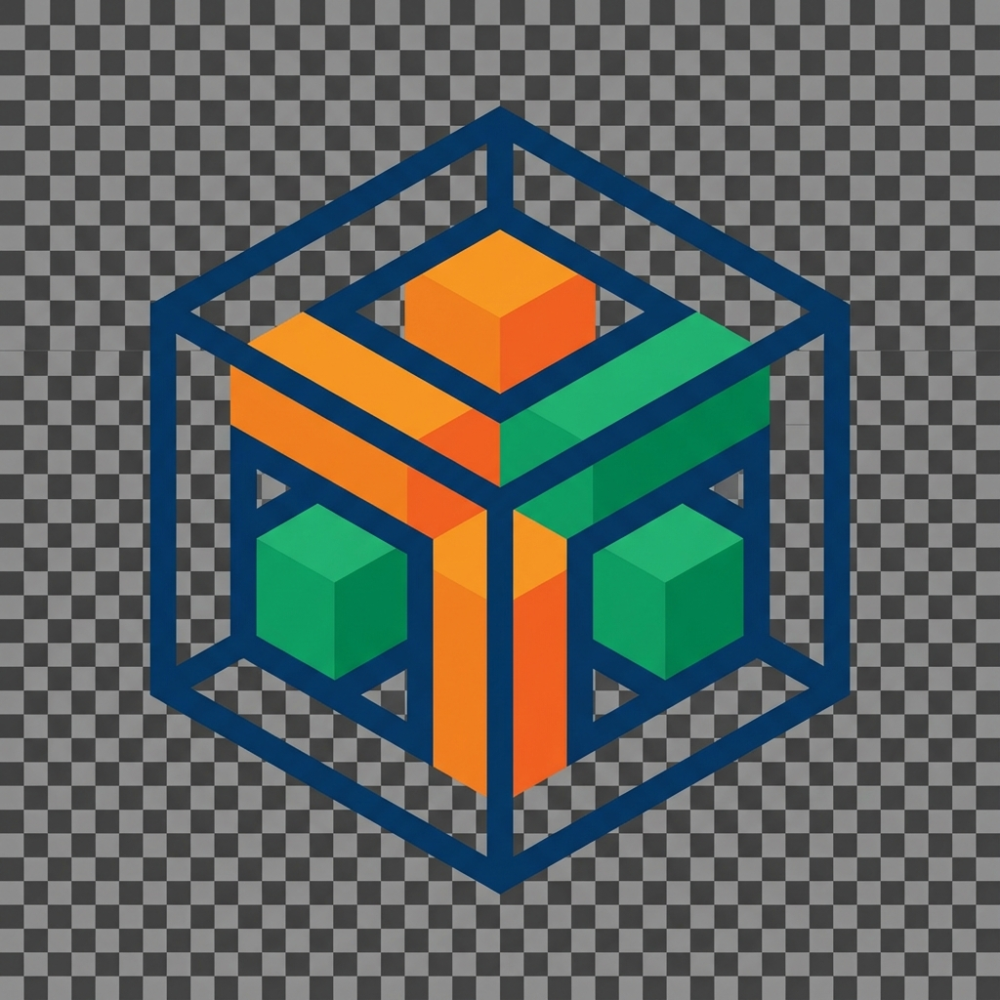

# 3D Container Packing Visualizer

A powerful web-based visualization tool for 3D container packing algorithms. This application allows users to simulate and visualize how items of various dimensions can be efficiently packed into a container using different algorithms.



## Features

-   **3D Visualization**: Interactive 3D view of the container and packed items using Three.js.
-   **Multiple Algorithms**:
    -   **First-Fit Decreasing (FFD)**: Sorts items by volume and packs them into the first available space.
    -   **Best-Fit**: Places items in positions that minimize wasted space.
    -   **Genetic Algorithm**: Uses evolutionary principles to find an optimal packing sequence.
-   **Rotation Support**: Automatically tries 6-axis rotation for each item to find the best fit.
-   **Real-time Interaction**: Add, remove, and manage items and container dimensions dynamically.
-   **Web Workers**: Computations run off the main thread for a smooth UI experience.

## Getting Started

### Prerequisites

-   Node.js (v16 or higher)
-   npm or yarn

### Installation

1.  Clone the repository:
    ```sh
    git clone https://github.com/yourusername/pack-3d-web.git
    ```
2.  Navigate to the project directory:
    ```sh
    cd pack-3d-web
    ```
3.  Install dependencies:
    ```sh
    npm install
    # or
    yarn install
    ```

### Running the Application

Start the development server:

```sh
npm run dev
# or
yarn dev
```

Open [http://localhost:8080](http://localhost:8080) to view it in the browser.

### Running Tests

To run the unit tests (including rotation logic verification):

```sh
npm test
```

## Technologies Used

-   **React**: UI Library
-   **TypeScript**: Static Typing
-   **Vite**: Build Tool
-   **Three.js / @react-three/fiber**: 3D Rendering
-   **Tailwind CSS**: Styling
-   **Web Workers**: Parallel Processing
-   **Vitest**: Testing Framework

## License

This project is open source and available under the [MIT License](LICENSE).
