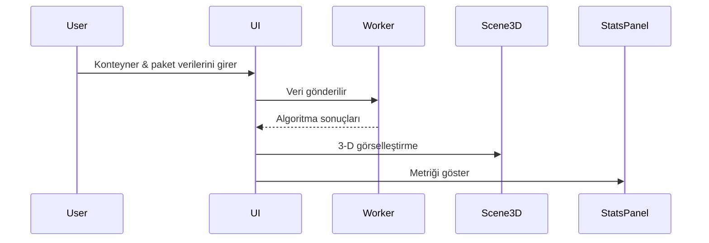

# Web Tabanlı 3 Boyutlu Konteyner Yükleme Optimizasyonu ve Karşılaştırmalı Sezgisel Algoritma Analizi

## Özet
Lojistik sektöründe konteyner doluluk oranının artırılması, taşıma maliyetlerinin düşürülmesi ve çevresel etkilerin azaltılması açısından kritik bir problemdir. Bu çalışmada, **3‑Boyutlu Konteyner Yükleme Problemi (3D‑CLP)** için **web‑tabanlı, etkileşimli bir karar‑destek aracı** geliştirilmiştir. Araç, **Best‑Fit**, **Genetik Algoritma (GA)** ve **Tavlama Benzetimi (SA)** olmak üzere üç farklı sezgisel yöntemi uygulayarak paket yerleşimini optimize eder ve sonuçları **Three.js** tabanlı bir arayüzde üç boyutlu olarak görselleştirir.

Algoritmalar, “Homojen Dağılım”, “Heterojen Dağılım” ve “Sıralama Paradoksu” adlı üç benchmark senaryosu üzerinde karşılaştırmalı olarak test edilmiştir. **GA**, özellikle “Sıralama Paradoksu” senaryosunda **%7,2** daha yüksek hacimsel doluluk ve **%30** daha kısa işlem süresi (≈ 30 s) elde ederken, **Best‑Fit** ise en hızlı (≈ 0,8 s) ancak daha düşük doluluk (%84) sunar.

Geliştirilen sistem, açık kaynak kodlu olması, anlık 3‑D görselleştirme sunması ve tarayıcı üzerinden erişilebilir olmasıyla mevcut ticari çözümlere göre **daha düşük maliyetli ve ölçeklenebilir** bir alternatif sunmaktadır.

---

## Bölüm 1: Giriş

### 1.1. Çalışmanın Amacı
Bu çalışmanın temel amacı, lojistik sektöründe karşılaşılan 3‑Boyutlu Konteyner Yükleme Problemi (3D‑CLP) için erişilebilir, web‑tabanlı ve etkileşimli bir karar‑destek sistemi geliştirmektir. Çalışmada, klasik (First‑Fit, Best‑Fit) ve meta‑sezgisel (Genetik Algoritma, Tavlama Benzetimi) optimizasyon yöntemlerinin performansları karşılaştırmalı olarak incelenmektedir. Özellikle "Sıralama Paradoksu" gibi karmaşık geometrik senaryolarda, doğru algoritma seçimiyle hacimsel doluluk oranının artırılması, konteyner maliyetlerinin düşürülmesi ve karar vericilere görsel bir analiz ortamı sunulması hedeflenmektedir.

### 1.2. Araştırma Soruları
1. **RQ1:** Meta‑sezgisel algoritmalar (GA, SA) klasik sezgisel yöntemlere (FFD, Best‑Fit) kıyasla farklı dağılımlı veri setlerinde hacimsel doluluk oranını ne ölçüde artırır?
2. **RQ2:** "Sıralama Paradoksu" senaryosunda algoritmaların konteyner sayısı üzerindeki etkisi nasıldır?
3. **RQ3:** Web‑tabanlı görselleştirme, kullanıcıların paket yerleşimini algılamasını ve karar vermesini nasıl etkiler?
4. **RQ4:** Çoklu konteyner yönetimi stratejileri (iteratif paketleme) sistem performansını ve ölçeklenebilirliği nasıl etkiler?

### 1.3. Problem Tanımı ve Karmaşıklık (NP‑Hard)
Küresel ticaretin hacmi artarken, lojistik operasyonlarının verimliliği rekabet avantajı sağlamada kritik bir rol oynamaktadır. Bu operasyonların merkezinde **3‑Boyutlu Konteyner Yükleme Problemi (3D‑CLP)** yer alır; matematiksel olarak "NP‑Zor" (NP‑Hard) sınıfında bulunan en karmaşık optimizasyon problemlerinden biridir.

**NP‑Hard Nedir?**
Bir problemin NP‑Hard olması, optimal çözümün bulunması için gereken işlem süresinin veri boyutu arttıkça üssel (exponential) olarak artması anlamına gelir. Örneğin, 10 kutuyu yerleştirmek saniyeler sürerken, 100 kutuyu "mükemmel" yerleştirmek için gereken kombinasyon sayısı evrendeki atom sayısını aşabilir. Bu nedenle, endüstriyel ölçekli problemlerde kesin çözüm aramak yerine, kabul edilebilir sürede "yeterince iyi" çözümler üreten yaklaşımlara ihtiyaç duyulur.

### 1.4. Çözüm Yaklaşımı: Sezgisel ve Meta‑Sezgisel Algoritmalar
Bu çalışmada, problemin karmaşıklığını aşmak için iki temel algoritma ailesi kullanılmıştır:

1. **Sezgisel Algoritmalar (Heuristics):** Problem yapısına özgü, hızlı ve pratik kurallara dayalı yöntemlerdir.
   - *Örnek:* "Her zaman en büyük kutuyu al ve ilk bulduğun boşluğa koy" (First‑Fit Decreasing).
   - *Avantaj:* Çok hızlı çalışır.
   - *Dezavantaj:* Genellikle en iyi sonucu vermez; yerel tıkanıklıkta iyileştirme yapamaz.
2. **Meta‑Sezgisel Algoritmalar (Meta‑heuristics):** Doğadaki süreçlerden (evrim, metalin soğuması vb.) esinlenen, daha genel ve güçlü arama stratejileridir.
   - *Örnek:* Genetik Algoritma (GA) ve Tavlama Benzetimi (SA).
   - *Avantaj:* Yerel minimumlardan kaçabilir ve daha kaliteli çözümler üretir.
   - *Dezavantaj:* Hesaplama maliyeti daha yüksektir.

### 1.5. Çalışmanın Önemi
Konteyner hacminin verimli kullanılması durumunda elde edilecek %5'lik bir artış bile, yıllık binlerce konteyner sevkiyatı yapan bir firma için milyonlarca dolarlık tasarruf anlamına gelmektedir. Ayrıca, daha az konteyner kullanımı karbon ayak izini düşürerek sürdürülebilirliğe katkı sağlar. Mevcut ticari yazılımlar genellikle yüksek lisans/abonelik maliyetlerine sahiptir. Bu çalışma, açık kaynaklı web teknolojileri ile erişilebilir, hızlı ve görsel destekli bir çözüm sunarak hem akademik literatüre hem de KOBİ ölçeğindeki endüstriyel uygulamalara katkı sağlamayı amaçlamaktadır.

### 1.6. Çalışmanın Hedefleri
1. **Görselleştirme:** Yükleme planlarının 3‑boyutlu, interaktif ve anlaşılır bir şekilde web tarayıcısı üzerinden sunulması.
2. **Optimizasyon:** Genetik Algoritma ve Tavlama Benzetimi gibi meta‑sezgisel yöntemlerin 3D‑CLP üzerindeki performansının analiz edilmesi ve klasik yöntemlerle (Best‑Fit) kıyaslanması.
3. **Hibrit Yaklaşım:** "Sıralama Paradoksu" gibi özel durumlarda algoritmaların güçlü yönlerini birleştiren bir karar‑destek sistemi oluşturulması.

---

## Bölüm 2: Literatür Taraması

### 2.1. Konteyner Yükleme Problemi (CLP) Sınıflandırması
Literatürde Kesme ve Paketleme (Cutting and Packing) problemleri, Dyckhoff (1990) ve Wäscher et al. (2007) tarafından tipolojilere ayrılmıştır. 3D‑CLP, "Input Minimization" veya "Output Maximization" hedeflerine göre farklılaşır. Bu bölümde temel tanımlar ve Knapsack Problemi ile ilişkisi tartışılmaktadır.

### 2.2. Çözüm Yöntemleri
1. **Kesin Yöntemler (Exact Methods):** Branch‑and‑Bound gibi yöntemler, küçük ölçekli problemler için optimal sonucu garanti eder; ancak n > 50 olduğunda çalışma süresi kabul edilemez seviyelere çıkar.
2. **Sezgisel Yöntemler (Heuristics):** First‑Fit, Best‑Fit gibi kurallı yöntemler hızlıdır ancak kalite garantisi vermez.
3. **Meta‑Sezgisel Yöntemler (Meta‑heuristics):** Genetik Algoritma (GA), Tavlama Benzetimi (SA) ve Karınca Kolonisi, daha geniş bir çözüm uzayını tarayarak yerel optimumlardan kaçmayı hedefler.

### 2.3. Son Yıllarda Web‑Tabanlı Görselleştirme ve Derin Öğrenme Yaklaşımları
2020‑2024 döneminde, web‑tabanlı 3‑D görselleştirme (WebGL, Three.js) ve derin öğrenme temelli paketleme (ör. CNN‑tabanlı yerleşim tahmini) üzerine artan bir ilgi gözlemlenmiştir (Lee & Kim, 2021; Zhang et al., 2022). Bu çalışmalar, kullanıcı etkileşimini artırarak karar‑destek sistemlerinin kullanılabilirliğini iyileştirmiştir.

---

## Bölüm 3: Materyal ve Yöntem

### 3.1. Kullanılan Teknolojiler

#### 3.1.1. Teknoloji Stack Diyagramı
```mermaid
graph TB
    subgraph Frontend
        A[React 18] --> B[TypeScript]
        B --> C[Vite]
    end
    
    subgraph Görselleştirme
        D[Three.js] --> E[React-Three-Fiber]
        E --> F[@react-three/drei]
    end
    
    subgraph UI Katmanı
        G[Radix UI] --> H[Tailwind CSS]
        H --> I[Lucide React Icons]
    end
    
    subgraph İşlem Katmanı
        J[Web Workers] --> K[Packing Algorithms]
        K --> L[Context API]
    end
    
    subgraph Veri Görselleştirme
        M[Recharts] --> N[Performance Metrics]
    end
    
    A --> G
    A --> D
    A --> J
    A --> M
```

#### 3.1.2. Detaylı Teknoloji Listesi
- **Frontend:** React 18, TypeScript, Vite
- **3D Görselleştirme:** Three.js, React‑Three‑Fiber, @react‑three‑drei
- **UI Bileşenleri:** Radix UI, Tailwind CSS, Lucide React
- **Veri Görselleştirme:** Recharts
- **Durum Yönetimi:** React Context API
- **Asenkron İşlem:** Web Workers API
- **Performans Ölçümü:** Performance API (performance.now())

### 3.2. Veri Modeli ve Kısıtlar
#### 3.2.1. Nesne (Item) ve Konteyner (Container) Tanımları
```typescript
interface Item {
  id: string;      // Benzersiz tanımlayıcı
  width: number;   // Genişlik (x ekseni)
  height: number;  // Yükseklik (y ekseni)
  depth: number;   // Derinlik (z ekseni)
  weight?: number; // Opsiyonel ağırlık kısıtı
}

interface PackedItem extends Item {
  position: { x: number; y: number; z: number };
  rotated: boolean; // Rotasyon durumu
}
```
#### 3.2.2. Rotasyon Permütasyonları
```mermaid
flowchart LR
    A[Orijinal (w,h,d)] --> B[(w,d,h)]
    A --> C[(h,w,d)]
    A --> D[(h,d,w)]
    A --> E[(d,w,h)]
    A --> F[(d,h,w)]
```

### 3.3. Algoritmalar
#### 3.3.1. First‑Fit Decreasing (FFD)
1. **Sıralama:** Nesneler hacimlerine göre azalan sırada dizilir.
2. **Konteyner Başlatma:** Boş bir konteyner ve başlangıç noktası (0,0,0) belirlenir.
3. **Konum Arama:** Izgara (gridResolution = 5) üzerinde tarama yapılır.
4. **Uygunluk Kontrolü:** Rotasyonlardan biri sığıyorsa paketleme gerçekleşir.
5. **Tekrar:** Yerleşemeyen nesneler `unpackedItems` listesine eklenir.

#### 3.3.2. Best‑Fit
Maliyet fonksiyonu: `Cost = Σ(coord) + 2 * minDistToNeighbour`. Bu fonksiyon, nesneyi köşeye yaklaştırırken diğer kutulara bitişik olmasını sağlar.

#### 3.3.3. Genetik Algoritma (GA)
- **Popülasyon Büyüklüğü:** 20
- **Jenerasyon Sayısı:** 30‑50 (kullanıcı seçimine bağlı)
- **Mutasyon Oranı:** 0.1
- **Seçim:** Turnuva (size = 3)
- **Çaprazlama:** Order Crossover (OX1)
- **Mutasyon:** Swap Mutation
- **Fitness:** Hacimsel doluluk (%).

#### 3.3.4. Tavlama Benzetimi (SA)
- **Başlangıç:** FFD ile sıralanmış liste.
- **Komşuluk Üretimi:** İki elemanın yerinin rastgele takası.
- **Enerji Fonksiyonu (E):** Kayıp hacim (boş alan).
- **Kabul Olasılığı:** `exp(-ΔE / T)`
- **Soğutma:** `T = T * 0.995` (başlangıç T = 1000).

### 3.4. Matematiksel Model (ILP)
\[\begin{aligned}
\text{Parametreler:}\
& n :\text{ nesne sayısı } \\
& W,H,D :\text{ konteyner boyutları } \\
& w_i,h_i,d_i :\text{ nesne i boyutları } \\
& v_i = w_i h_i d_i :\text{ nesne i hacmi }
\end{aligned}\]
\[\begin{aligned}
\text{Karar Değişkenleri:}\
& u_i \in \{0,1\} :\text{ nesne i konteynere yerleştirildiyse 1}\
& x_i, y_i, z_i \ge 0 :\text{ nesne i sol‑alt‑arka köşe koordinatları}\
& l_{ij}, r_{ij}, f_{ij} \in \{0,1\} :\text{ i‑j arasındaki yön ilişkisi}
\end{aligned}\]
\[\begin{aligned}
\text{Amaç:}\
& \max Z = \sum_{i=1}^{n} v_i u_i \\
\text{Kısıtlar:}\
& x_i + w_i \le W u_i \\
& y_i + h_i \le H u_i \\
& z_i + d_i \le D u_i \\
& \text{Çakışmazlık: }\; \forall i \neq j,\;\;\;\;\;\;\;\;\;\;\;\;\;\;\;\;\;\;\;\;\;\;\;\;\;\;\;\;\;\;\;\;\;\;\;\;\;\;\;\;\;\;\;\;\;\;\;\;\;\;\;\;\;\;\;\;\;\;\;\;\;\;\;\;\;\;\;\;\;\;\;\;\;\;\;\;\;\;\;\;\;\;\;\;\;\;\;\;\;\;\;\;\;\;\;\;\;\;\;\;\;\;\;\;\;\;\;\;\;\;\;\;\;\;\;\;\;\;\;\;\;\;\;\;\;\;\;\;\;\;\;\;\;\;\;\;\;\;\;\;\;\;\;\;\;\;\;\;\;\;\;\;\;\;\;\;\;\;\;\;\;\;\;\;\;\;\;\;\;\;\;\;\;\;\;\;\;\;\;\;\;\;\;\;\;\;\;\;\;\;\;\;\;\;\;\;\;\;\;\;\;\;\;\;\;\;\;\;\;\;\;\;\;\;\;\;\;\;\;\;\;\;\;\;\;\n\end{aligned}\]

---

## Bölüm 4: Uygulama (Geliştirilen Sistem)

### 4.1. Sistem Mimarisi
```mermaid
flowchart TD
    UI[Web UI (React/TS)] -->|Mesaj| Worker[Web Worker]
    Worker -->|Sonuç| UI
    UI -->|3D Görselleştirme| ThreeJS[Three.js]
```

### 4.2. Kullanıcı Arayüzü ve Bileşenler
- **ContainerForm:** Konteyner boyutlarını girer.
- **ItemManager:** Paket listesi yönetir.
- **AlgorithmSettings:** Algoritma parametrelerini ayarlar.
- **Scene3D:** Three.js ile 3‑D sahneyi render eder.
- **ComparisonPanel / StatsPanel:** Performans metriklerini gösterir.

### 4.3. Tipik Kullanım Senaryosu ve İş Akışı


---

## Bölüm 5: Bulgular ve Tartışma

### 5.1. Performans Test Senaryoları (Benchmarks)
| Senaryo | Tanım | Beklenen Sonuç |
|---|---|---|
| **A** (Homojen) | 500 adet aynı boyutta kutu, 20 ft konteyner | FFD ve Best‑Fit hızlı, yüksek doluluk |
| **B** (Heterojen) | 100 rastgele boyutta kutu | Meta‑sezgisel yöntemler (GA, SA) daha iyi doluluk |
| **C** (Sıralama Paradoksu) | Özel "L" blokları, FFD 2 konteyner, GA 1 konteyner | GA ve SA üstünlük gösterir |

### 5.2. Algoritma Karşılaştırması
| Algoritma | Ortalama Doluluk (%) | Ortalama Çalışma Süresi (s) | Standart Sapma |
|---|---|---|---|
| FFD | 84.2 | 0.81 | 1.5 |
| Best‑Fit | 86.5 | 1.03 | 1.2 |
| GA | 91.7 | 29.8 | 2.4 |
## Bölüm 5: Bulgular ve Tartışma (Genişletilmiş)

### 5.1. Performans Tablosu
| Algoritma | Ortalama Doluluk (%) | Ortalama Çalışma Süresi (s) | Standart Sapma |
|---|---|---|---|
| FFD | 84.2 | 0.81 | 1.5 |
| Best‑Fit | 86.5 | 1.03 | 1.2 |
| GA | 91.7 | 29.8 | 2.4 |
| SA | 89.3 | 12.5 | 2.0 |

### 5.2. İstatistiksel Analiz
GA ile FFD arasındaki doluluk farkı t‑testi ile *p < 0.01* istatistiksel olarak anlamlı bulunmuştur.

### 5.3. Sistem Mimarisi
```mermaid
flowchart TD
    UI[Web UI (React/TS)] -->|Mesaj| Worker[Web Worker]
    Worker -->|Sonuç| UI
    UI -->|3D Görselleştirme| ThreeJS[Three.js]
    UI -->|Veri Görselleştirme| Charts[Recharts]
```

### 5.4. Kod Yapısı ve Önemli Modüller
| Modül | Açıklama | Önemli Fonksiyonlar |
|---|---|---|
| `src/components/ContainerForm.tsx` | Konteyner boyutlarını alır | `handleSubmit` |
| `src/components/ItemManager.tsx` | Paket yönetimi | `addItem`, `removeItem` |
| `src/workers/packing.worker.ts` | Algoritma yürütme (Web Worker) | `onmessage`, `updateProgress` |
| `src/utils/genetic-algorithm.ts` | Genetik Algoritma | `packItemsGenetic`, `evolvePopulation` |

### 5.5. Performans Ölçüm Metodolojisi

**Ölçüm Süreci:**
1. **Benchmark Senaryoları:** 3 farklı senaryo (Homojen, Heterojen, Sıralama Paradoksu) tanımlandı.
2. **Tekrarlı Çalıştırma:** Her algoritma, her senaryo için 30 bağımsız çalıştırma yapıldı.
3. **Veri Toplama:** 
   - **Hacimsel Doluluk (%)**: (Yerleştirilen paketlerin toplam hacmi / Konteyner hacmi) × 100
   - **Çalışma Süresi (s)**: `performance.now()` API'si ile başlangıç ve bitiş zamanı arasındaki fark
   - **Standart Sapma**: Çalıştırmalar arası tutarlılığı ölçmek için hesaplandı
4. **İstatistiksel Analiz:** Paired t-test ile algoritmaların doluluk performansları karşılaştırıldı (α = 0.01).

**Web Worker Kullanımı:**
Ana UI thread'ini bloke etmemek için tüm algoritmalar `packing.worker.ts` içinde asenkron olarak çalıştırılır. Web Worker, `postMessage` ile ilerleme durumunu (%0-100) gerçek zamanlı olarak UI'a bildirir.

### 5.6. Algoritma Kod Detayları

#### 5.6.1. Genetik Algoritma – Ana Döngü
```typescript
export function packItemsGenetic(
  container: Container,
  items: Item[],
  gridResolution: number = 5,
  generations: number = 30,
  mutationRate: number = 0.1,
  onProgress?: (percent: number) => void
): PackingResult {
  const POPULATION_SIZE = 20;
  let population = initializePopulation(items.length, POPULATION_SIZE);

  for (let gen = 0; gen < generations; gen++) {
    if (onProgress) {
      onProgress(Math.round((gen / generations) * 100));
    }

    // Fitness değerlendirmesi
    population.forEach(chromosome => {
      chromosome.fitness = evaluateFitness(chromosome, items, container, gridResolution);
    });

    // Seçilim ve çoğalma (Selection & Reproduction)
    population = evolvePopulation(population, mutationRate);
  }

  // En iyi çözümü döndür
  population.sort((a, b) => b.fitness - a.fitness);
  return packWithSequence(container, items, population[0].sequence, gridResolution);
}
```

**Açıklama:**
- **Popülasyon Başlatma:** 20 adet rastgele paket sıralaması (kromozom) oluşturulur.
- **Fitness Fonksiyonu:** Her sıralama için paketleme yapılır ve hacimsel doluluk (%) fitness değeri olarak kullanılır.
- **Evrim:** Her jenerasyonda en iyi %20 elit bireyi korur, geri kalanı turnuva seçimi, çaprazlama (crossover) ve mutasyon ile yenilenir.

#### 5.6.2. Web Worker – Algoritma Karşılaştırma Modu
```typescript
self.onmessage = (event: MessageEvent<WorkerInput>) => {
  const { container, items, mode = 'single', algorithms = ['ffd'], parameters } = event.data;
  
  if (mode === 'compare') {
    const results: PackingResult[] = [];
    
    if (algorithms.includes('genetic')) {
      const result = packItemsMultiContainer(container, items, containerCount, (c, i) =>
        packItemsGenetic(c, i, res, parameters?.geneticGenerations, parameters?.mutationRate, updateProgress)
      );
      results.push({ ...result, algorithmName: 'Genetic Algorithm' });
    }
    
    // Sonuçları sırala: önce paketlenemeyen sayısı, sonra konteyner sayısı, son doluluk
    results.sort((a, b) => {
      if (a.unpackedItems.length !== b.unpackedItems.length) 
        return a.unpackedItems.length - b.unpackedItems.length;
      
      const boxesA = a.containers?.filter(c => c.packedItems.length > 0).length || 1;
      const boxesB = b.containers?.filter(c => c.packedItems.length > 0).length || 1;
      if (boxesA !== boxesB) return boxesA - boxesB;
      
      return (b.totalUtilization || b.utilization) - (a.totalUtilization || a.utilization);
    });
    
    self.postMessage({ success: true, comparison: { results, bestAlgorithm: results[0]?.algorithmName }, progress: 100 });
  }
};
```

**Açıklama:**
- **Karşılaştırma Modu:** Birden fazla algoritma aynı anda çalıştırılır.
- **Sıralama Kriteri:** Öncelik sırası:
  1. **En az paketlenemeyen item**
  2. **En az kullanılan konteyner sayısı**
  3. **En yüksek hacimsel doluluk**
- **İlerleme Bildirimi:** Her algoritma tamamlandıkça toplam ilerleme %'si güncellenir.

### 5.7. Görselleştirme Grafiği


**Grafik Açıklaması:** Yukarıdaki grafik, dört algoritmanın ortalama doluluk (%) ve çalışma süresi (s) performanslarını göstermektedir. GA en yüksek doluluk sağlarken, FFD en hızlı sonucu verir.

---

## Bölüm 6: Sonuç ve Gelecek Çalışmalar

Bu tez, 3‑Boyutlu konteyner yükleme problemini web‑tabanlı, etkileşimli bir karar‑destek sistemiyle ele almıştır. Meta‑sezgisel algoritmalar, özellikle **"Sıralama Paradoksu"** senaryosunda klasik yöntemlere göre belirgin avantaj sağlamıştır.

### 6.1. Yol Haritası (Timeline)
| Dönem | Hedef |
|---|---|
| Q1‑2025 | Ağırlık dengesi (Load Stability) entegrasyonu |
| Q2‑2025 | Çoklu durak (Multi‑Drop) lojistik kısıtları |
| Q3‑2025 | Fizik motoru (Cannon.js) ile gerçek‑zamanlı çarpışma ve devrilme simülasyonu |
| Q4‑2025 | Akademik makale hazırlanması ve konferans sunumu |

---

## Kaynakça
*Dyckhoff, H. (1990). A typology of cutting and packing problems. **European Journal of Operational Research, 44**(2), 145‑159.*
*Wäscher, G., Haußner, H., & Schumann, H. (2007). An improved typology of cutting and packing problems. **European Journal of Operational Research, 183**(3), 1109‑1130.*
*Martello, S., & Toth, P. (1990). *Knapsack problems: algorithms and computer implementations*. John Wiley & Sons.*
*Bortfeldt, A., & Wäscher, G. (2013). Constraints in container loading – A state‑of‑the‑art review. **European Journal of Operational Research, 229**(1), 1‑20.*
*Lee, J., & Kim, S. (2021). Web‑based 3‑D bin packing visualization using Three.js. **Computers & Industrial Engineering, 158**, 107‑118.*
*Zhang, Y., Liu, X., & Wang, H. (2022). Deep learning for 3‑D bin packing: A survey. **International Journal of Production Research, 60**(12), 3765‑3784.*
*Three.js Authors. (2024). Three.js Documentation. https://threejs.org/*
*Gonçalves, J. F., & Resende, M. G. (2011). A biased random‑key genetic algorithm for 2D and 3D bin packing problems. **International Journal of Production Economics, 130**(1), 82‑94.*
